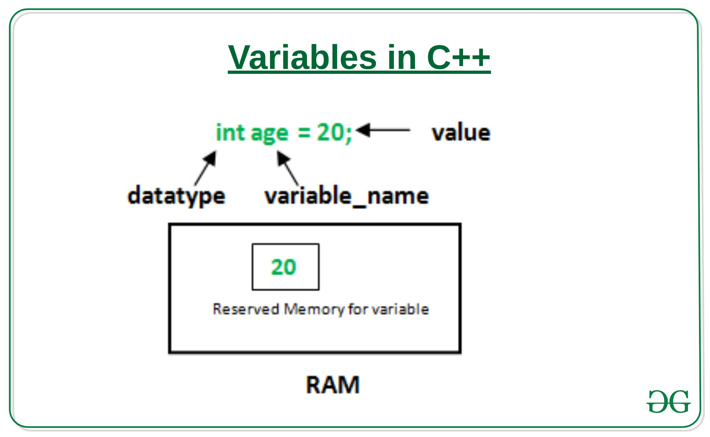

A variable is a name given to a memory location. It is the basic unit of storage in a program.

The value stored in a variable can be changed during program execution.
A variable is only a name given to a memory location, all the operations done on the variable effects that memory location.
In C++, all the variables must be declared before use.
How to declare variables?

A typical variable declaration is of the form:

// Declaring a single variable
type variable_name;

// Declaring multiple variables:
type variable1_name, variable2_name, variable3_name;
A variable name can consist of alphabets (both upper and lower case), numbers and the underscore ‘_’ character. However, the name must not start with a number.



```
#include <iostream>
using namespace std;
  
int main()
{
    // declaration and definition
    // of variable 'variable'
    int variable1 = 10;
  
  
    // Let us print a variable
    cout << variable1 << endl;
  
    return 0;
}
```

Output:
```
10
```

[Video Link](https://www.youtube.com/watch?v=jigb6W35zHc&list=PLu0W_9lII9agpFUAlPFe_VNSlXW5uE0YL&index=3)

from 5:16 to 14:40

